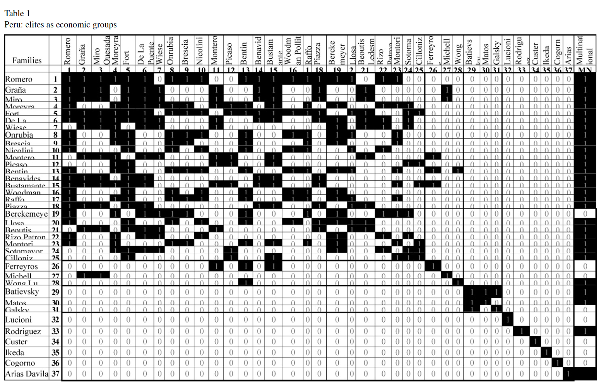

# Network Analysis en R


Tenemos esta información:



## 1. Importando datos

```{r, eval=TRUE, message=FALSE}
FileName='dataFigueroa.csv'
adjacency=read.csv(FileName)
```

El formato es una matriz de adyacencia, por lo que debería ser cuadrada:

```{r, eval=TRUE, message=FALSE}
dim(adjacency)
```

Sucede que la ultima columna es un atributo, y la primera repite los apellidos:
```{r, eval=TRUE, message=FALSE}
names(adjacency)
```
Guardemos apellidos y atributo:

```{r}
attributes=adjacency[,c('Names','multinational')]
head(attributes)
```

Pasemos el atributo a categoría:
```{r}
attributes$multinational=factor(attributes$multinational,levels = c(0,1),labels = c("No", "Si"),ordered = F)
```

Ahora, pasemos _Names_ como nombre de fila:

```{r, eval=TRUE, message=FALSE}
row.names(adjacency)=adjacency$Names
adjacency$Names=NULL
adjacency$multinational=NULL

# asi:
head(adjacency)
```


Nota que la estructura es _data frame_:
```{r}
class(adjacency)
```


Pasemosla a  **matriz**.

```{r, eval=TRUE, message=FALSE}
adjacency=as.matrix(adjacency) 
```


Llevemos la matriz a grafo con la ayuda de **Igraph**:

```{r, eval=TRUE, message=FALSE}
library(igraph)
EliteNet=graph.adjacency(adjacency,mode="undirected",weighted=NULL)
# see it here
EliteNet
```

Un grafo está compuesto de _nodos_ o  _vertices_, y _edges_ o _enlaces_ que los conectan, Aquí podemos ver cuántos hay de cada uno:
```{r, eval=TRUE, message=FALSE}
vcount(EliteNet) #conteo de nodos
```

```{r, eval=TRUE, message=FALSE}
ecount(EliteNet) #conteo de enlaces
```


Gráficamente:

```{r, eval=TRUE, message=FALSE}
plot.igraph(EliteNet,
            vertex.color = 'yellow',
            edge.color='lightblue')
```

Añadimos los atributos:


```{r, eval=TRUE, message=FALSE}
EliteNet=set_vertex_attr(EliteNet,"multi",value=attributes$multinational)

#then
EliteNet
```
tienes:
```{r, eval=TRUE, message=FALSE}
vertex_attr_names(EliteNet) 
```

Esta red estará "conectada":


```{r, eval=TRUE, message=FALSE}
is_connected(EliteNet)
```

Cuantos "componentes"?
```{r, eval=TRUE, message=FALSE}
components(EliteNet)$no
```

Quienes en cada _componente_:

```{r, eval=TRUE, message=FALSE}
groups(components(EliteNet))
```

Componente como atributo:
```{r, eval=TRUE, message=FALSE}
component=components(EliteNet)$membership
EliteNet=set_vertex_attr(EliteNet,"component",value=component)
#asi:
EliteNet
```


Graficamente:

```{r, eval=TRUE, message=FALSE}
Labels=component
numberOfClasses = length(unique(Labels)) 

#preparando color
library(RColorBrewer)
colorForScale='Set2'
colors = brewer.pal(numberOfClasses, colorForScale)

# graficando
plot.igraph(EliteNet,
             vertex.color = colors[Labels],
             edge.color='lightblue')
```

Quedemonos con el _Giant Component_:

1. conteos:

```{r, eval=TRUE, message=FALSE}
(Sizes=components(EliteNet)$csize)
```

2. eligiendo:
```{r, eval=TRUE, message=FALSE}
EliteNet_giant=induced.subgraph(EliteNet, which(Labels == which.max(Sizes)))
```


veamos al _Giant Component_:


```{r, eval=TRUE, message=FALSE}
plot.igraph(EliteNet_giant)
```

Resumen:

```{r, eval=TRUE, message=FALSE}
summary(EliteNet_giant)
```


## 2. Exploración


### Metricas totales:


* Densidad (Density): va de  0 a 1. 1 significa que hay un link entre cada par de nodos.

<center></center>

```{r, eval=TRUE, message=FALSE}
graph.density(EliteNet_giant)
```

* Diameter: El mayor de los _geodesicos_ (el _sendero_(path) menor entre cualquier par de nodos)


```{r, eval=TRUE, message=FALSE}
diameter(EliteNet_giant)
```


* El coeficiente de agrupamiento (clustering coefficient)  cuantifica qué tanto está  agrupado un nodo con sus vecinos. Si está conectado con todos es 1. Así, coeficiente de agrupamiento local es el promedio de esos valores.

```{r, eval=TRUE, message=FALSE}
transitivity(EliteNet_giant,type = 'average')
```

* Shortest path (average): es el promedio de todos los senderos menores de la red.


```{r, eval=TRUE, message=FALSE}
average.path.length(EliteNet_giant)
```

**Random networks** tienen *pequeños shortest path* and *pequeño clustering coefficient*.


* Transitivity: qué tan probable es que dos nodes con algun contacto en común tambíen estén conectados.


```{r, eval=TRUE, message=FALSE}
transitivity(EliteNet_giant)
```

* Assortativity (degree): Mide la tendencia a conectarse con nodos de grado similar.  Mientras mas cerca a  1 hay mayor assortativity, mas cerca a -1 diassortativity; pero 0 es ausencia de assortitivity.

```{r, eval=TRUE, message=FALSE}
assortativity_degree(EliteNet_giant)
```

No solo para grado de conexiones, sino otro atributo:

```{r, eval=TRUE, message=FALSE}
attrNet=V(EliteNet_giant)$multi
assortativity_nominal(EliteNet_giant,attrNet)
```

Coloreando por atributo:

```{r, eval=TRUE, message=FALSE}
LabelsColor=attrNet
colors=c('lightblue','magenta')
plot.igraph(EliteNet_giant,
       vertex.color = colors[LabelsColor])
```


### Comunidades

* La red presenta cliques? (conjunto de nodos donde todos están conectados mutuamente)

```{r, eval=TRUE, message=FALSE}
length(cliques(EliteNet_giant))
```

Un clique puede estar anidado. Si un clique no puede crecer más (dejando de ser clique): **maximal clique**.


* Cuántos maximal cliques?
```{r, eval=TRUE, message=FALSE}
count_max_cliques(EliteNet_giant)
```


Tamaño del _maximal clique_:

```{r, eval=TRUE, message=FALSE}
clique_num(EliteNet_giant)
```


* Cuales son los más grandes?
```{r, eval=TRUE, message=FALSE}
max_cliques(EliteNet_giant,min=8)
```

Si hay cliques, es claro que hay  **comunidades**. Detectar comunidades es un área enorme de investigación, usemos uno de los algoritmos conocido como el  [método _Louvain_](https://perso.uclouvain.be/vincent.blondel/research/louvain.html).


```{r, eval=TRUE, message=FALSE}
communities=cluster_louvain(EliteNet_giant)
(partition=membership(communities))
```


Ahora, usamos esos valores para resaltar las comunidades:

```{r, eval=TRUE, message=FALSE}
Labels=partition
numberOfClasses = length(unique(Labels)) 

library(RColorBrewer)
colorForScale='Set2'
colors = brewer.pal(numberOfClasses, colorForScale)

plot.igraph(EliteNet_giant,
             vertex.color = colors[Labels],
             edge.color='lightblue')
```


